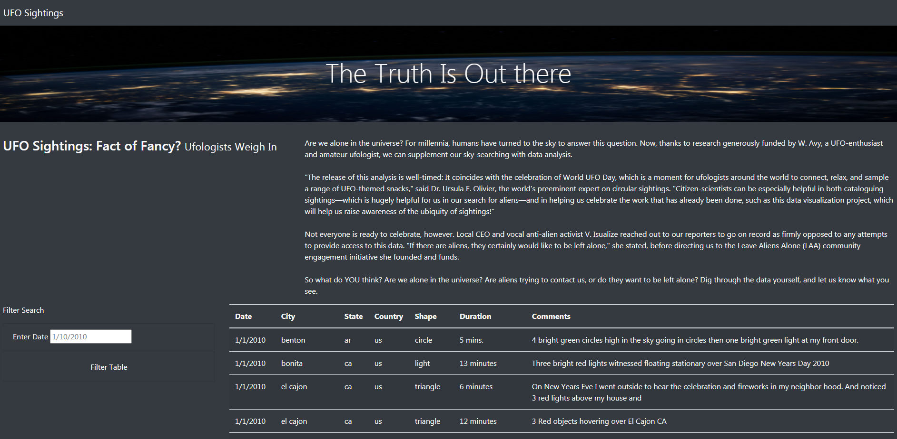
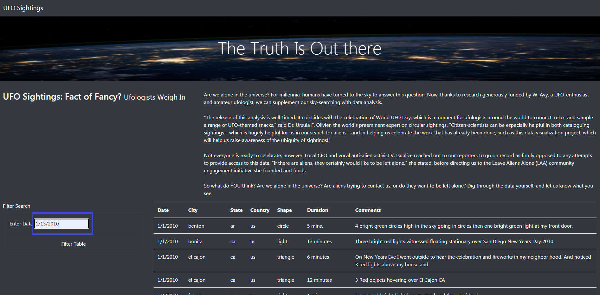
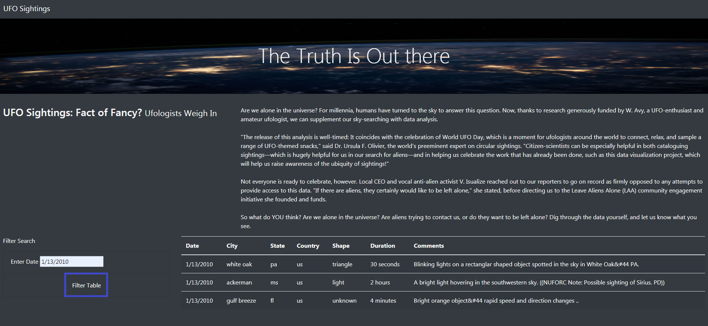
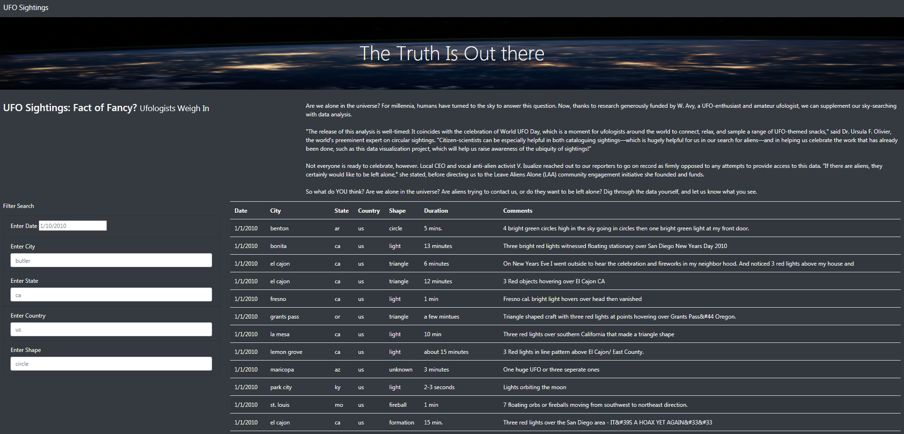
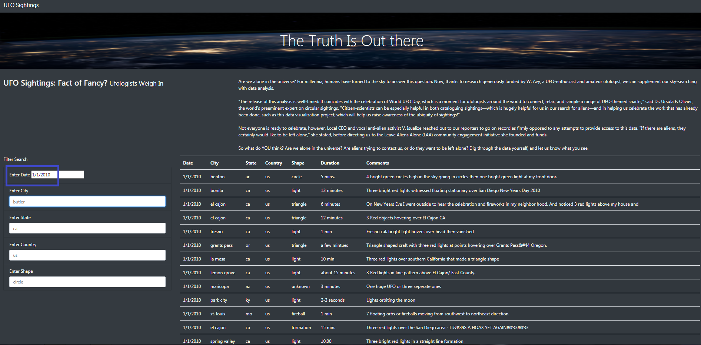
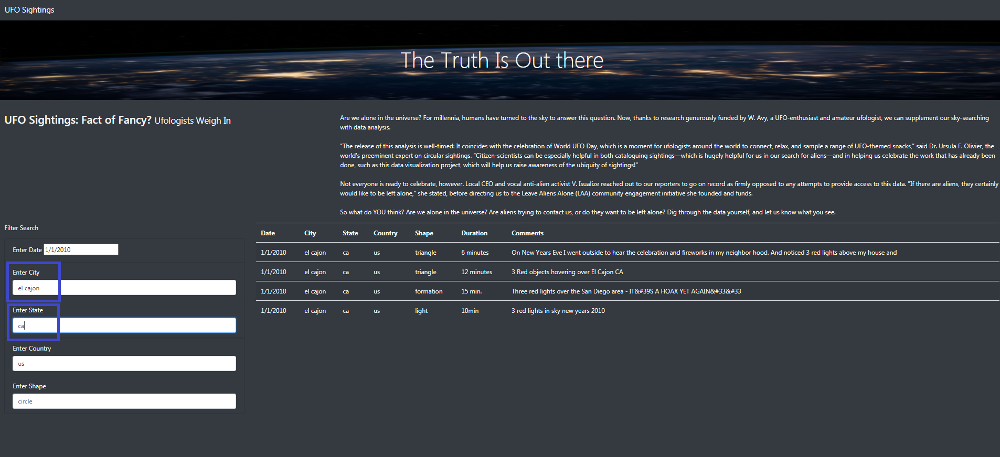
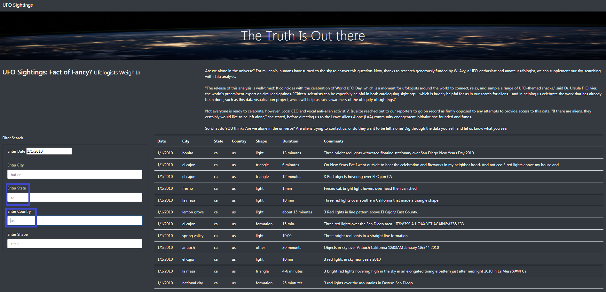
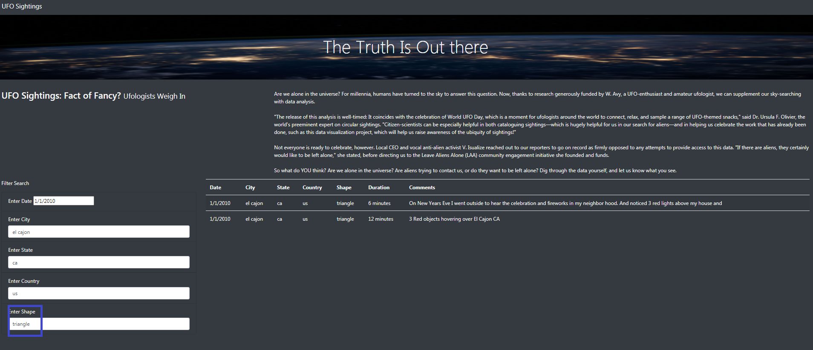
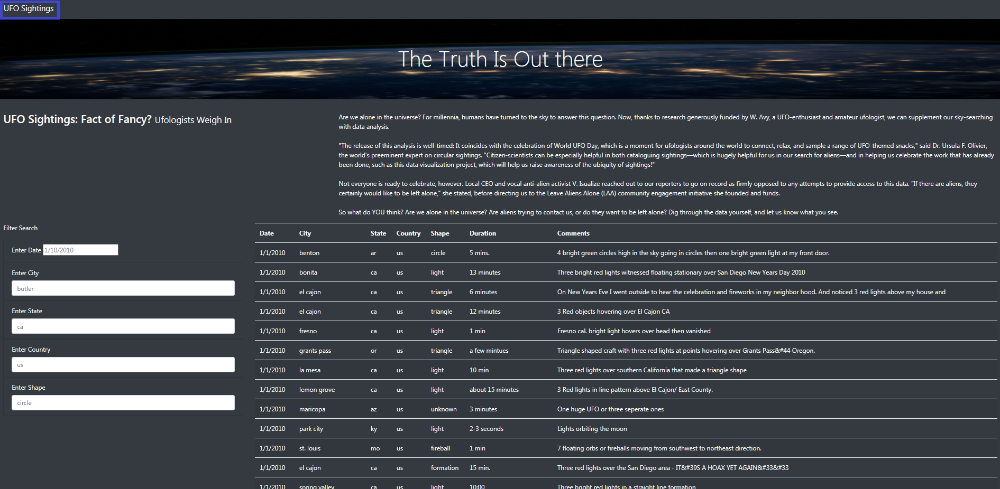

# UFOs

## Module Project Overview

We are creating a webpage for Dana that has a dynamic table, which is filtered using the date fieldwhich provides a more in-depth analysis of UFO sightings by allowing users to filter for multiple criteria at the same time. Following filters are used on the table date, city, state, country, and shape.

## Resources:
  - Data Source: data.js
  - Software: JavaScript, HTML, CSS
  - Library: bootstrap 4.0.0, d3 4.11.0

## Module Project Analysis

  We can use date filter as follows to filter table data.

  - webpage:
  
    

  - filter:
    Enter date into the date filter textbox as shown 
    
    
  
  - filtered table:
    Click on the button to filter the table data
    
    
  

## Challenge Overview

We are enhancing the webpage we already created for Dana by adding additional filters, which provides a more in-depth analysis of UFO sightings by allowing users to filter for multiple criteria at the same time. Following filters are used on the table date, city, state, country, and shape.

## Challenge Analysis

  We can use the multiple filters to filter data as shown below
  
  - challenge webpage:
  
  
  
  - date filter:
    Enter date into the date filter textbox as shown and the table data is filtered right away
  
  
  
  - city and state filter:
    Enter city and state as shown and data is filtered further
  
  
  
  - state and country filter:
    Enter state and country to filter data
  
  
  
  - shape filter:
    Enter shape to filter data even further
  
  
  
  - Reset filters:
    Reset filters by clicking on 'UFO Sightings' nav-bar up on top left.
  
  
  

### Summary

Based on the search criteria data displayed on the table changes dynamically.

#### Drawback of this webpage
The main drawback on this page is searching, we can only search on a whole match of the text entered and is in lowercase. We cannot search on a partial match or mixed case text entry.

#### Additional recommendations for further development

  Drawbacks are the recommendations for future development
  - Add Partial text search using string includes() function as opposed to '===' or '==' operators.
  - Add mixed case search by converting the text to all lowercase or uppercase.